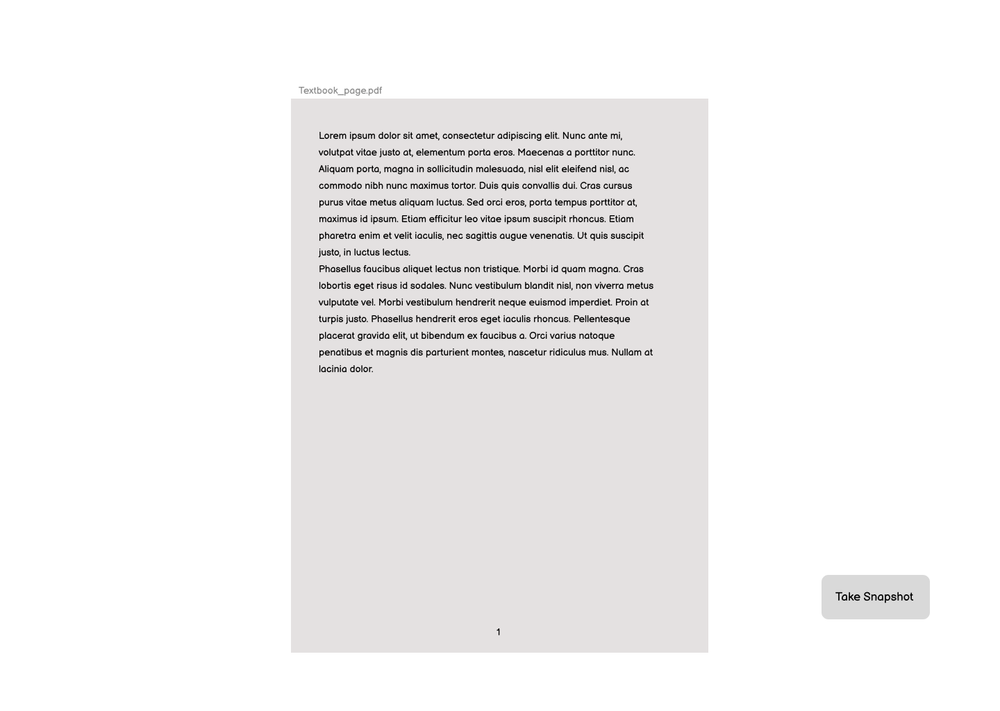
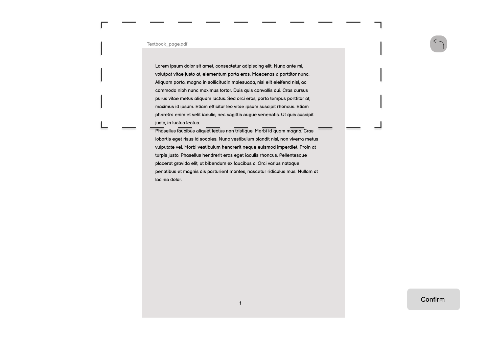

# Wireframes

## Initiation

The user will start by pressing an assigned keybind which is represented by the "snapshot" button to initiate the screen-shot tool

Then the user will click and drag the cursor to their desired area to copy text from.

## Snapshot

Default page will display basic functions such as settings, exit page, and folder. It also shows the user the copied text in a text file ready to be exported.

Setting page allows the users to set certain functions to their preference

Folder page will give the user the option to look through previous saved files

